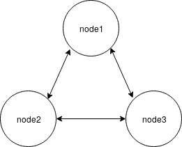

# c-lightning Docker Setup

The docker-compose images and the instructions in this repository are to setup a local Bitcoin network (regtest mode) and run a Lightning Network (c-lightning nodes) over it.

## Setup

There is one docker-compose file for each node in our Lightning Network. Each docker-compose file has two services each, one that runs `bitcoind` and another that runs `lightningd`. We will need an instance of both for each node. We can connect all the c-lightning daemons to the same `bitcoind` instance, but for the sake of completeness we will set up an instance of `bitcoind` for each node.

The bitcoind containers will be named `bitcoind1`, `bitcoind2` and so on, and the corresponding lightningd containers `lightningd1`, `lightningd2` and so on. We will be opening multiple terminal windows to interact with the daemons via CLI. A single shell instance can also be used but I find it convenient to have separate shells open to each container.

We will be setting up a topology as follows:


You can create more nodes by duplicating the docker-compose files and set up a topology of your choice.

All the containers are connected via a `LN_testing` docker network. We first create the docker network:
```bash
docker network create 'LN_testing'
```

Note that there may be a better way to do this, but I am new to docker and this was one way I found to go about this. If there is a more optimal way, feel free to raise a pull request.

## Running the containers
Clone the repository onto your PC:
```bash
git clone https://github.com/samvid25/c-lightning-docker.git
```

Create the `lightningd` and `bitcoind` containers. Run this for all the docker-compose files in different terminal windows/tabs.
```bash
docker-compose -f "docker-compose-1.yml" up
```
Now, our 4 lightning nodes are set-up. Open 2 terminals each for every node, one to interact with `bitcoind` and one for `lightningd`. Repeat the following for every node in different terminals:

```bash
docker exec -i -t bitcoind1 bash
```
```bash
docker exec -i -t lightnind1 bash
```
We will be using `bitcoin-cli` to interact with `bitcoind` and `lightning-cli` to interact with `lightningd`. Aliases can be used to make your life easier as you will be using these commands a lot:
```bash
bitcoind1$ cat >> /home/.bashrc
alias bc='bitcoin-cli'

bitcoind1$ source /home/.bashrc
```
```bash
lightningd1$ cat >> /home/.bashrc
alias lc='lightning-cli'

lightningd1$ source /home/.bashrc
```
Repeat the same for all containers.

But using bitcoin-cli runs into a `rpcuser` error where it says credentials are not found. We will have to manually edit the `bitcoin.conf` file present at `/root/.bitcoin/`:
```bash
bitcoind1$ cat > /root/.bitcoin/bitcoin.conf
printtoconsole=1
rpcallowip=::/0
regtest=1
whitelist=0.0.0.0/0
server=1
rpcuser=rpcuser
rpcpassword=rpcpass
```
To ensure that all the nodes have a copy of the same blockchain, establish connections within themselves by appending a `addnode=bitcoind1` to the config file for the subsequent `bitcoind` instances. (`addnode=bitcoind2` can also be added to `bitcoind3` and so on)

I believe this can also be done via the docker-compose file without having to manually doing it after container deployment. Will update the docker-compose files with the same soon.

The following sections assume you run the commands in their appropriate terminals (bitcoin-cli in the bitcoind terminals and the lightning-cli in the lightningd terminals) for the required nodes.

Generate a few blocks on one of the nodes and see if the other nodes detect the blocks. If so, then the containers have been set up correctly.
```bash
bitcoind1$ bc generate 5
```

## Creating connections

Obtain the ID of all the lightning nodes using:
```bash
lightningd1$ lc getinfo | grep id

lightningd2$ lc getinfo | grep id

lightningd3$ lc getinfo | grep id
```

Then connect the nodes to each other:
```bash
lightningd1$ lc connect <id2>@lightningd2
lightningd1$ lc connect <id3>@lightningd3

lightningd2$ lc connect <id3>@lightningd3
```

Now, we need a payment address to fund the node. Run the following on all the nodes and note the generated address for each node:
```bash
lightningd1$ lc newaddr

lightningd2$ lc newaddr

lightningd3$ lc newaddr
```

Now, we need to fund these nodes. Generate a few blocks so that some bitcoin is created. And then send funds (as required) to the addresses:
```bash
bitcoind1$ bc generate 200
bitcoind1$ bc sendtoaddress <address1> 200
bitcoind1$ bc sendtoaddress <address2> 200
bitcoind1$ bc sendtoaddress <address3> 200
bitcoind1$ bc generate 10
```
A few blocks are generated at the end to confirm the above transactions.

Use the following command to check if funds have been received or not. Note that it may take time for the funds to be appear due to block synchronization delays.
```bash
lightningd1$ lc listfunds

lightningd2$ lc listfunds

lightningd3$ lc listfunds
```

## Opening channels

Once the nodes have enough funds to open a channel, channels can be opened with:
```bash
lightningd1$ lc fundchannel <id2> 150000

lightningd2$ lc fundchannel <id3> 150000

lightningd3$ lc fundchannel <id1> 150000
```
But the the funding transaction for this channel is still unconfirmed. Hence, a few blocks have to be generated to confirm the funding transaction and change the `state` of the channel to `CHANNELD_NORMAL` and make its visibility public.
```bash
bitcoind1$ bc generate 10
```

All the known (active) channels in the network can be listed using:
```bash
lightningd1$ lc listchannels
```
In a larger network, the existance of a path to a node identified by <id> can be checked using:
```bash
lc getroute <id> <msatoshi> <riskfactor>
```

## Optional: Changing lightningd configuration

Modify (or Add if it doesn't exist) the config file present at `/root/.lightning/` with the required parameters and restart lightningd:
```bash
lightningd1$ lc stop
```
```bash
docker start lightningd1
docker exec -i -t lightningd1 bash
```

_in progress_
